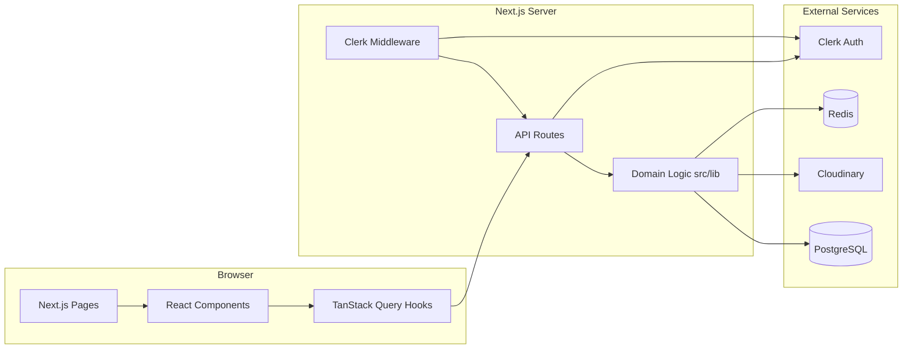
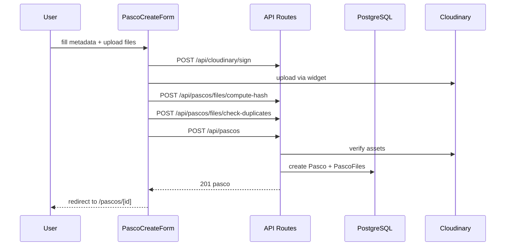

# Architecture

High-level overview of how Uni Pasco Hub is structured and how requests flow through the system.

## Request flow



## Tech stack layers

| Layer        | Location               | Responsibility                                         |
| ------------ | ---------------------- | ------------------------------------------------------ |
| Pages        | `src/app/`             | Route entry points (server components)                 |
| API          | `src/app/api/`         | REST endpoints, auth checks, HTTP responses            |
| Domain logic | `src/lib/`             | Business rules, Prisma queries, Cloudinary, validation |
| Client API   | `src/lib/api/`         | Axios wrappers for frontend                            |
| Hooks        | `src/hooks/api/`       | TanStack Query options and mutations                   |
| Components   | `src/components/`      | UI: gates, forms, domain widgets, shadcn primitives    |
| Types        | `src/types/api/`       | Shared TypeScript types for API contracts              |
| Schema       | `prisma/schema.prisma` | Database models and enums                              |
| Generated    | `generated/prisma/`    | Prisma client (do not edit)                            |

## Folder structure

```text
unipascohub/
├── prisma/
│   ├── schema.prisma          # Data model
│   └── migrations/            # SQL migration history
├── src/
│   ├── app/
│   │   ├── layout.tsx         # Root layout, Clerk provider, header
│   │   ├── page.tsx           # Home (API smoke test)
│   │   ├── pascos/            # Pasco pages (new, detail, edit)
│   │   └── api/               # REST API routes
│   ├── components/            # React components
│   ├── hooks/api/             # TanStack Query hooks
│   ├── lib/                   # Server and shared domain logic
│   ├── types/api/             # API type definitions
│   └── proxy.ts               # Clerk middleware
├── scripts/                   # CLI utilities
├── docs/                      # Documentation
└── generated/prisma/          # Generated Prisma client
```

## Runtime boundaries

### Server-only

- All `src/app/api/` route handlers
- `src/lib/db.ts`, `src/lib/pascos.ts`, `src/lib/cloudinary.ts`, and most of `src/lib/`
- Prisma queries and Cloudinary SDK calls

### Client (`"use client"`)

- Form components, engagement bar, file viewer
- TanStack Query hooks and API client (`src/lib/api/client.ts`)
- Auth gates (`PascoCreateGate`, `PascoEditGate`)

### Shared

- Zod schemas (`src/lib/schemas/`)
- Type definitions (`src/types/api/`)
- Display helpers (`src/lib/catalog-labels.ts`, `src/lib/pasco-file-types.ts`)

## Middleware and public routes

[`src/proxy.ts`](../src/proxy.ts) runs Clerk middleware on all routes except Next.js internals and static files. All page routes are public at the proxy layer; sign-in is enforced in UI gates and API handlers where needed.

**Public at the edge** (no `auth.protect()`):

- `/api/webhooks`
- `/api/institutions`, `/api/programs`, `/api/courses` (and sub-routes)
- `/api/pascos` (and sub-routes)

**Protected at the edge** (`auth.protect()` required):

- `/api/users/*`
- `/api/cloudinary/sign`
- `/api/admin/*`

Many public routes enforce authentication inside the handler for mutations (e.g. `POST /api/pascos` requires a contributor). This allows anonymous browsing of catalog and pasco listings while keeping write operations gated.

## Key design decisions

### Clerk for auth + local User row for roles

Clerk handles sign-in, sessions, and identity. A `User` row in PostgreSQL stores app-specific data: `role`, `school`, and relations to pascos and engagement. Users are synced via webhooks and an SSR fallback component.

### Cloudinary for file storage

Files are uploaded directly to Cloudinary via a signed widget flow. Assets are stored under `pascos/{courseId}/` folders. The database stores metadata (`publicId`, `fileUrl`, `contentHash`) but not file bytes.

### Content-hash duplicate detection

Each file is fingerprinted with SHA-256 before pasco creation. Duplicates are rejected at upload time and again at create time to prevent the same exam paper from being uploaded twice.

### Signed URLs for view and download

Raw Cloudinary URLs are not exposed for viewing or downloading. The API returns time-limited signed URLs after auth and rate-limit checks.

### Storage cleanup logging

When Cloudinary assets fail to delete (during pasco update/delete or orphan cleanup), failures are persisted in `StorageCleanupFailure` for admin inspection. Batch orphan scans are logged in `StorageCleanupRun`.

## Data flow: create pasco



See [file-uploads.md](file-uploads.md) for the full upload pipeline.

## Related docs

- [authentication.md](authentication.md) — roles and permission gates
- [data-model.md](data-model.md) — database schema
- [api/](api/) — REST API reference
- [frontend.md](frontend.md) — UI structure
