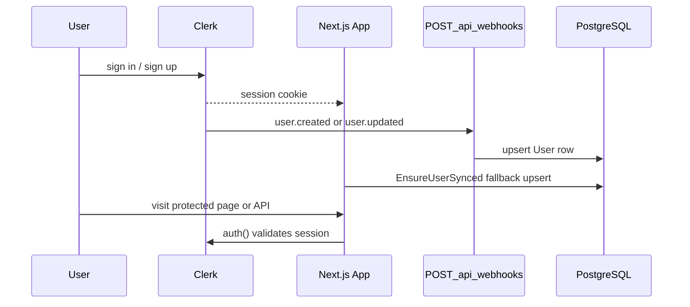

# Authentication and Authorization

Uni Pasco Hub uses [Clerk](https://clerk.com/) for authentication and a local PostgreSQL `User` table for application roles and profile data.

## Integration points

| Location                                                                            | Purpose                                                                                       |
| ----------------------------------------------------------------------------------- | --------------------------------------------------------------------------------------------- |
| [`src/app/layout.tsx`](../src/app/layout.tsx)                                       | `ClerkProvider`, sign-in/sign-up buttons, `UserButton`                                        |
| [`src/proxy.ts`](../src/proxy.ts)                                                   | Clerk middleware; protects `/api/users/*`, `/api/cloudinary/sign`, `/api/admin/*` at the edge |
| [`src/app/api/webhooks/route.ts`](../src/app/api/webhooks/route.ts)                 | Syncs `user.created`, `user.updated`, `user.deleted` to PostgreSQL                            |
| [`src/components/ensure-user-synced.tsx`](../src/components/ensure-user-synced.tsx) | Upserts user on page load if webhook is delayed                                               |
| [`src/lib/user-sync.ts`](../src/lib/user-sync.ts)                                   | `upsertUserFromClerk`, `deleteUserById`                                                       |
| [`src/lib/user-roles.ts`](../src/lib/user-roles.ts)                                 | `upgradeToContributor`, `promoteToModerator`                                                  |

## Sign-in flow

## Roles

Defined in Prisma as `UserRole` ([`prisma/schema.prisma`](../prisma/schema.prisma)):

| Role          | Description                                                            |
| ------------- | ---------------------------------------------------------------------- |
| `NORMAL_USER` | Default for new users. Can browse, react, and download when signed in. |
| `CONTRIBUTOR` | Can upload and create pascos. Can edit/delete own pascos.              |
| `MODERATOR`   | Contributor capabilities plus edit/delete any pasco.                   |
| `ADMIN`       | Full catalog CRUD, promote moderators, admin/ops endpoints.            |

## Capability matrix

| Action                      | NORMAL_USER | CONTRIBUTOR | MODERATOR | ADMIN |
| --------------------------- | :---------: | :---------: | :-------: | :---: |
| Browse catalog and pascos   |     Yes     |     Yes     |    Yes    |  Yes  |
| React (like/dislike)        |     Yes     |     Yes     |    Yes    |  Yes  |
| Download files              |     Yes     |     Yes     |    Yes    |  Yes  |
| View files in-app           |     Yes     |     Yes     |    Yes    |  Yes  |
| Upload / create pasco       |     No      |     Yes     |    Yes    |  Yes  |
| Edit own pasco              |     No      |     Yes     |    Yes    |  Yes  |
| Edit any pasco              |     No      |     No      |    Yes    |  Yes  |
| Delete own pasco            |     No      |     Yes     |    Yes    |  Yes  |
| Delete any pasco            |     No      |     No      |    Yes    |  Yes  |
| Self-upgrade to contributor |     Yes     |      —      |     —     |   —   |
| Catalog CRUD                |     No      |     No      |    No     |  Yes  |
| Promote to moderator        |     No      |     No      |    No     |  Yes  |
| Admin / ops endpoints       |     No      |     No      |    No     |  Yes  |

## Server-side authorization

### `requireContributor(userId)`

[`src/lib/require-contributor.ts`](../src/lib/require-contributor.ts)

Used for: pasco create, Cloudinary sign, hash/duplicate endpoints.

Allows: `CONTRIBUTOR`, `MODERATOR`, `ADMIN`.

Returns `401` if not signed in, `403` if role insufficient, `404` if user not in database.

### `canModifyPasco(actorUserId, pasco)`

[`src/lib/require-contributor.ts`](../src/lib/require-contributor.ts)

Used for: pasco update (not delete).

Allows if:

- Actor is the pasco uploader, **or**
- Actor is `MODERATOR` or `ADMIN`

### `canDeletePasco(actorUserId, pasco)`

[`src/lib/pasco-delete-permissions.ts`](../src/lib/pasco-delete-permissions.ts)

Used for: pasco delete.

Allows if:

- Actor is the pasco uploader, **or**
- Actor is `ADMIN`

Moderators can edit any pasco but cannot delete.

### `requireAdmin(userId)`

[`src/lib/require-admin.ts`](../src/lib/require-admin.ts)

Used for: catalog mutations, admin cleanup endpoints, promote to moderator.

Allows: `ADMIN` only.

### `requireModerator(userId)`

[`src/lib/require-moderator.ts`](../src/lib/require-moderator.ts)

Used for: moderation queue, restore/flag actions, read threshold settings.

Allows: `MODERATOR`, `ADMIN`.

Admin-only: `PATCH /api/admin/settings/moderation`, pasco delete (any pasco).

## Client-side gates

### `PascoCreateGate`

[`src/components/pasco-create-gate.tsx`](../src/components/pasco-create-gate.tsx)

1. Requires sign-in (shows sign-in CTA if not)
2. Requires contributor role (shows self-upgrade CTA for `NORMAL_USER`)

### `PascoEditGate`

[`src/components/pasco-edit-gate.tsx`](../src/components/pasco-edit-gate.tsx)

1. Requires sign-in
2. Requires `canUserModifyPasco` ([`src/lib/pasco-permissions.ts`](../src/lib/pasco-permissions.ts))

### `ModerationGate`

[`src/components/moderation-gate.tsx`](../src/components/moderation-gate.tsx)

1. Requires sign-in
2. Requires moderator or admin role

Client gates improve UX; the API enforces the same rules server-side.

## Role changes

| Transition                    | How                                                                |
| ----------------------------- | ------------------------------------------------------------------ |
| `NORMAL_USER` → `CONTRIBUTOR` | User calls `POST /api/users/upgrade-to-contributor` (self-service) |
| Any → `MODERATOR`             | Admin calls `POST /api/users/[userId]/promote-to-moderator`        |
| Any → `ADMIN`                 | Manual database update (no API endpoint)                           |

For local development, set roles directly in Prisma Studio or via SQL.

## Middleware vs handler auth

Catalog and pasco **read** endpoints are public at the middleware layer ([`src/proxy.ts`](../src/proxy.ts)). Mutations check `auth()` inside the route handler.

Engagement endpoints (reactions, downloads, file view URLs) require sign-in in the handler even though the pasco routes are public at the edge.

## Related docs

- [data-model.md](data-model.md) — `User` model
- [api/users.md](api/users.md) — user API endpoints
- [features.md](features.md) — auth feature summary
