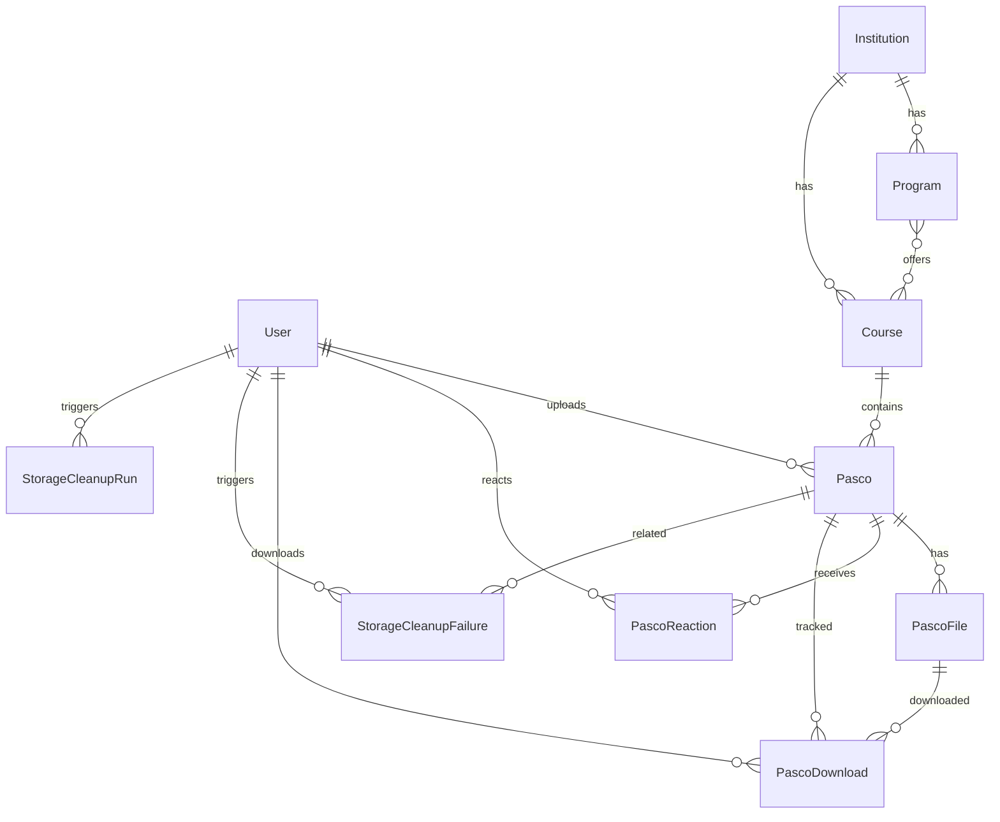

# Data Model

Database schema reference. Source of truth: [`prisma/schema.prisma`](../prisma/schema.prisma).

## Entity relationship diagram



## Models

### User

| Field       | Type     | Notes                        |
| ----------- | -------- | ---------------------------- |
| `id`        | String   | Clerk user ID (primary key)  |
| `name`      | String   | From Clerk first + last name |
| `school`    | String?  | User-editable via profile    |
| `role`      | UserRole | Default `NORMAL_USER`        |
| `createdAt` | DateTime |                              |
| `updatedAt` | DateTime |                              |

### Institution

| Field  | Type   | Notes  |
| ------ | ------ | ------ |
| `id`   | String | cuid   |
| `name` | String | Unique |

Top-level academic organization (e.g. a university).

### Program

| Field           | Type        | Notes                 |
| --------------- | ----------- | --------------------- |
| `id`            | String      | cuid                  |
| `institutionId` | String      | FK → Institution      |
| `name`          | String      |                       |
| `type`          | ProgramType | BACHELOR, BTECH, etc. |

Unique per `(institutionId, name, type)`.

### Course

| Field           | Type   | Notes            |
| --------------- | ------ | ---------------- |
| `id`            | String | cuid             |
| `institutionId` | String | FK → Institution |
| `code`          | String | e.g. `DCIT 101`  |
| `title`         | String |                  |

Unique per `(institutionId, code)`. Linked to programs via many-to-many.

### Pasco

| Field                  | Type                  | Notes                           |
| ---------------------- | --------------------- | ------------------------------- |
| `id`                   | String                | cuid                            |
| `courseId`             | String                | FK → Course                     |
| `uploaderId`           | String?               | FK → User (set null on delete)  |
| `academicYear`         | String                | Format `YYYY/YYYY`              |
| `description`          | String?               |                                 |
| `educationLevel`       | EducationLevel        | LEVEL_100 … LEVEL_400           |
| `semesterType`         | SemesterType          | FIRST_SEMESTER, SECOND_SEMESTER |
| `type`                 | PascoType             | MID_SEM, END_OF_SEM, RESIT      |
| `contentType`          | PascoContentType      | QUESTIONS_ONLY, etc.            |
| `solutionCompleteness` | SolutionCompleteness? | Only when answers included      |
| `isComplete`           | Boolean               | False if upload is partial      |
| `likeCount`            | Int                   | Denormalized counter            |
| `dislikeCount`         | Int                   | Denormalized counter            |
| `downloadCount`        | Int                   | Denormalized counter            |
| `viewCount`            | Int                   | Denormalized counter            |

### PascoFile

| Field          | Type                   | Notes                            |
| -------------- | ---------------------- | -------------------------------- |
| `id`           | String                 | cuid                             |
| `pascoId`      | String                 | FK → Pasco (cascade delete)      |
| `order`        | Int                    | Display order (unique per pasco) |
| `publicId`     | String                 | Cloudinary public ID (unique)    |
| `fileName`     | String                 | Original filename                |
| `fileSize`     | Int                    | Bytes                            |
| `fileUrl`      | String                 | Cloudinary delivery URL          |
| `resourceType` | CloudinaryResourceType | IMAGE or RAW                     |
| `contentHash`  | String?                | SHA-256 fingerprint              |

### PascoReaction

One reaction per user per pasco. Unique on `(userId, pascoId)`.

### PascoDownload

Records each signed-in download event (user, pasco, file).

### StorageCleanupFailure

Tracks Cloudinary assets that failed to delete. `resolvedAt` is null until manually resolved.

### StorageCleanupRun

Logs batch orphan cleanup scans (dry-run or execute).

## Enums (product meaning)

| Enum                     | Values                                              | Meaning                                   |
| ------------------------ | --------------------------------------------------- | ----------------------------------------- |
| `UserRole`               | NORMAL_USER, CONTRIBUTOR, MODERATOR, ADMIN          | Permission tier                           |
| `ProgramType`            | BACHELOR, BTECH, BTECH_TOP_UP, HND, DIPLOMA         | Degree program category                   |
| `EducationLevel`         | LEVEL_100 … LEVEL_400                               | Student year level                        |
| `SemesterType`           | FIRST_SEMESTER, SECOND_SEMESTER                     | Academic semester                         |
| `PascoType`              | MID_SEM, END_OF_SEM, RESIT                          | Exam period                               |
| `PascoContentType`       | QUESTIONS_ONLY, QUESTIONS_AND_ANSWERS, ANSWERS_ONLY | What the upload contains                  |
| `SolutionCompleteness`   | FULLY_SOLVED, PARTIALLY_SOLVED                      | Answer quality (when applicable)          |
| `CloudinaryResourceType` | IMAGE, RAW                                          | Cloudinary delivery type (PDFs use IMAGE) |
| `PascoReactionType`      | LIKE, DISLIKE                                       | User reaction                             |
| `StorageCleanupSource`   | PASCO_SYNC, PASCO_DELETE, ORPHAN_BATCH              | Why cleanup was attempted                 |

## Indexes

| Model                 | Index                                                    | Purpose                    |
| --------------------- | -------------------------------------------------------- | -------------------------- |
| Pasco                 | `(courseId, educationLevel, academicYear)`               | Filtered browse queries    |
| Pasco                 | `createdAt DESC`                                         | Recent listings            |
| Pasco                 | `likeCount DESC`, `downloadCount DESC`, `viewCount DESC` | Popular sort               |
| PascoFile             | `contentHash`                                            | Duplicate detection        |
| PascoReaction         | `(pascoId, reactionType)`                                | Reaction counts            |
| StorageCleanupFailure | `(resolvedAt, createdAt)`                                | Unresolved failure queries |

## Catalog relationships

- **Institution-scoped**: both programs and courses belong to an institution.
- **Course ↔ Program**: many-to-many. A course can appear in multiple programs; a program has many courses.
- **Pasco → Course**: each pasco belongs to exactly one course.

## Migration workflow

```bash
# After editing prisma/schema.prisma
pnpm prisma migrate dev --name describe_your_change
pnpm prisma generate
```

Migrations are in [`prisma/migrations/`](../prisma/migrations/). Never edit applied migration files.

## Generated client

Prisma client is generated to `generated/prisma/`. Import from there in server code:

```typescript
import { prisma } from "@/lib/db";
```

## When you change the schema, update this doc

Edit the relevant model table and ER diagram if relations change.

## Related docs

- [authentication.md](authentication.md) — roles
- [api/catalog.md](api/catalog.md) — catalog API
- [api/pascos.md](api/pascos.md) — pasco API
