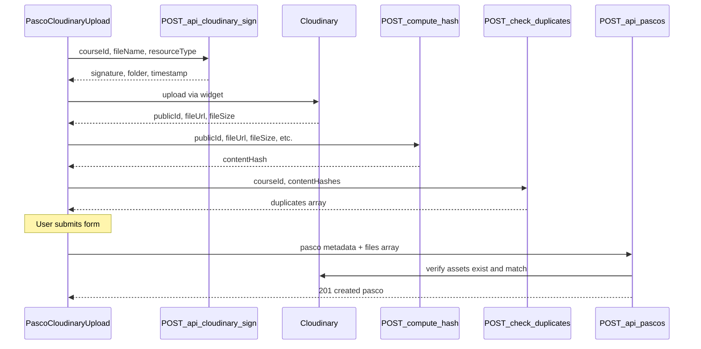

# File Uploads

End-to-end documentation for the pasco file upload pipeline.

## Overview

Files are uploaded directly from the browser to Cloudinary using a signed widget flow. The server never receives file bytes — it validates metadata, computes content hashes, and persists references in PostgreSQL.

## Upload sequence



Implementation: [`src/components/pasco-cloudinary-upload.tsx`](../src/components/pasco-cloudinary-upload.tsx)

## Allowed file types

Defined in [`src/lib/pasco-file-types.ts`](../src/lib/pasco-file-types.ts):

| Category  | Extensions                |
| --------- | ------------------------- |
| Images    | jpg, jpeg, png, webp, gif |
| PDFs      | pdf                       |
| Documents | doc, docx, txt, rtf, odt  |

**Not allowed:** spreadsheets (xls, xlsx, csv, ods, tsv, numbers)

## File size limits

| Limit               | Default | Env var                     |
| ------------------- | ------- | --------------------------- |
| Max per file        | 5 MB    | `PASCO_MAX_FILE_SIZE_BYTES` |
| Max files per pasco | 10      | `PASCO_MAX_FILES_PER_PASCO` |

Oversized files show a user-friendly message suggesting [iLovePDF](https://www.ilovepdf.com/compress_pdf) compression.

## Cloudinary folder structure

Files are stored under:

```text
pascos/{courseId}/{auto-generated-id}
```

The sign endpoint sets the upload folder based on `courseId`. On pasco create/update, the server verifies each asset exists in the expected folder.

## Resource types

| File kind | `resourceType` | In-app viewing   |
| --------- | -------------- | ---------------- |
| PDF       | `IMAGE`        | PDF embed viewer |
| Image     | `IMAGE`        | Image viewer     |
| Document  | `RAW`          | Download only    |

PDFs must use `IMAGE` resource type (Cloudinary treats them as image resources for delivery).

## Content hash (duplicate detection)

After upload, the client calls `POST /api/pascos/files/compute-hash`. The server downloads the asset from Cloudinary and computes a SHA-256 fingerprint.

Before form submission, `POST /api/pascos/files/check-duplicates` checks hashes against existing `PascoFile.contentHash` values.

Duplicates are blocked at:

1. **Pre-submit** — duplicate check API warns in the UI
2. **Create/update** — server rejects with `409 duplicate_file_content`

Logic: [`src/lib/content-hash.ts`](../src/lib/content-hash.ts), [`src/lib/pasco-file-hash.ts`](../src/lib/pasco-file-hash.ts)

## Signed URLs

Raw Cloudinary URLs stored in the database are not used directly for viewing or downloading.

| Action      | Endpoint                          | TTL                                             |
| ----------- | --------------------------------- | ----------------------------------------------- |
| View in-app | `POST .../files/:fileId/view`     | `PASCO_DOWNLOAD_URL_TTL_SECONDS` (default 300s) |
| Download    | `POST .../files/:fileId/download` | Same                                            |

Signed URL generation: [`src/lib/cloudinary.ts`](../src/lib/cloudinary.ts)

## Pasco delete and file sync

### On delete

Deleting a pasco removes all `PascoFile` rows (cascade) and attempts to delete each asset from Cloudinary. Failures are logged to `StorageCleanupFailure`.

### On edit (file sync)

Updating a pasco with a `files` array:

- Files with `id` + `order` are kept (reordered)
- New files (full create shape) are added
- Files not in the array are deleted from Cloudinary and the database

Failed Cloudinary deletions are returned in `storageCleanupFailures` and persisted for admin review.

## Configuration

Required env vars: see [`.env.example`](../.env.example) (Cloudinary section).

`CLOUDINARY_UPLOAD_PRESET` must be a **signed** upload preset. Uploads are signed server-side: before each file transfer, the widget requests a signature from `POST /api/cloudinary/sign`, which validates the widget's params (asset folder `pascos/{courseId}`, preset name, `source: uw`) before signing with the API secret. Never set the preset to unsigned mode — that would allow signature-less uploads that bypass the folder and preset validation.

## Related docs

- [api/pascos.md](api/pascos.md) — upload helper and file endpoints
- [operations.md](operations.md) — orphan cleanup for stranded assets
- [features.md](features.md) — file handling feature summary
